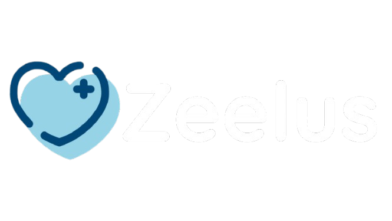
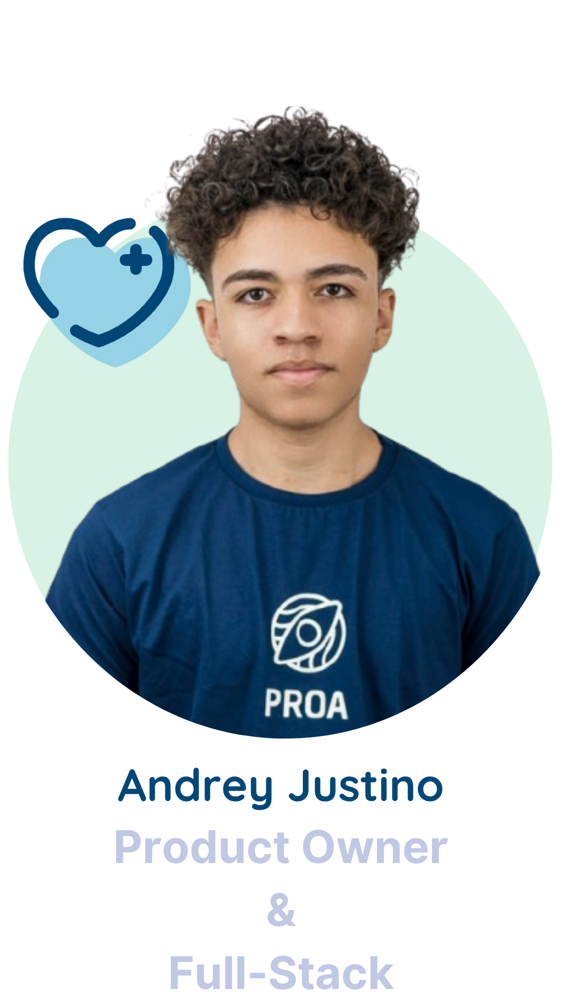
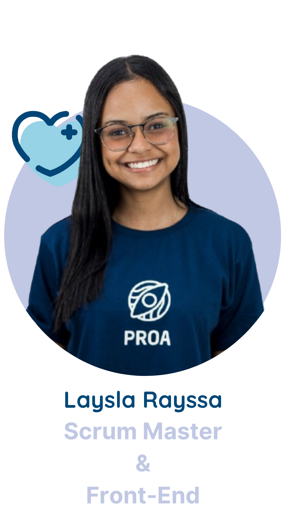
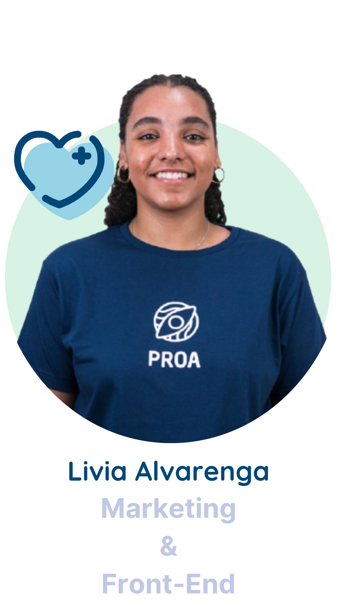
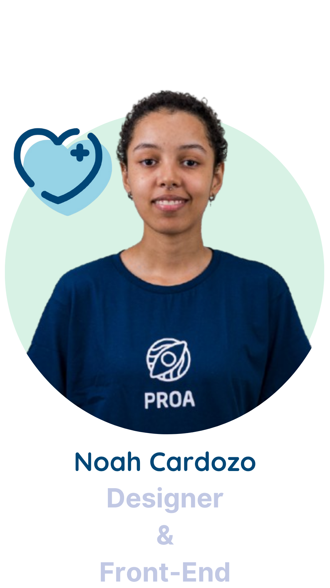
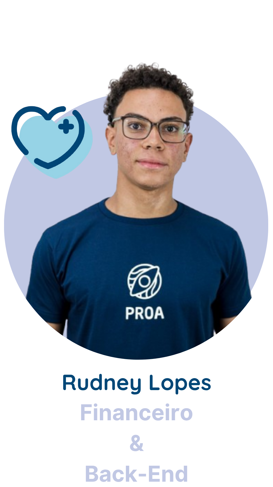
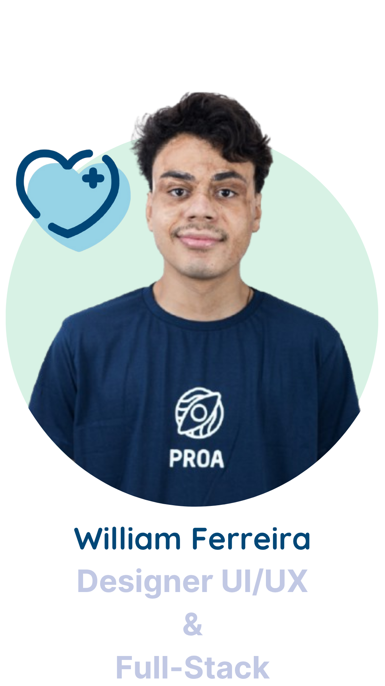

# ZEELUS: Cuidando de quem cuida

  

---

## 📑 Índice

  
<strong>Clique para expandir</strong>

1. [Objetivo do projeto](#objetivo-do-projeto)
2. [Tecnologias usadas](#tecnologias-usadas)
3. [Funcionalidades](#funcionalidades)
4. [Missão](#missão)
5. [Visão](#visão)
6. [Valores](#valores)
7. [Próximos passos](#próximos-passos)
8. [Identidade Visual](#identidade-visual)
9. [Equipe](#equipe)
10. [Links Úteis](#links-úteis)
11. [Nossas redes e contatos](#nossas-redes-e-contatos)
12. [Licença](#licença)

---

## 🎯 Objetivo do projeto

Zeelus é uma plataforma digital que visa oferecer suporte e ferramentas essenciais para acompanhantes informais de pessoas atípicas, tornando o ato de cuidar mais leve, humano e organizado. Através de funcionalidades interativas, a solução promove acolhimento, educação e gestão, fortalecendo o elo entre quem cuida e quem é cuidado.

---

## 🚀 Tecnologias usadas

  
  
  
  
  
  

---

## 🛠️ Funcionalidades

**Autenticação e Conta**
- Login com e-mail e senha
- Cadastro de cuidadores informais

**Organização e Monitoramento**
- Diário de registros
- Agenda
- Registro de anamnese

**Comunidade**
- Fórum com tópicos e moderação
- Troca de experiências entre cuidadores

**Recursos Educacionais**
- Primeiros socorros em formato acessível

**Bem-estar do Cuidador**
- Mensagens de motivação personalizadas

**Monetização**
- Plano gratuito com anúncios
- Plano Premium com IA, backups e mais recursos

---

## 💡 Missão

Oferecer suporte e ferramentas essenciais aos acompanhantes informais, tornando a experiência de cuidar mais leve e repleta de empatia. Cuidando assim, de quem cuida.

---

## 👀 Visão

Ser referência em soluções digitais para cuidadores informais, promovendo cuidado acessível, apoio emocional e capacitação, tornando o ato de cuidar mais digno, humano e eficiente.

---

## 🌱 Valores

- Empatia  
- Acolhimento  
- Conectividade  
- Inovação  
- Inclusão  

---

## 🗺️ Próximos passos

### Curto prazo
- [ ] Finalizar MVP funcional e intuitivo

### Médio prazo
- [ ] Ampliar funcionalidades com treinamentos e chat entre cuidadores

### Longo prazo
- [ ] Criar marketplace de cuidadores e aba de empregabilidade

---

## 🎨 Identidade Visual

**Cores**

| Cor            | Código HEX | Exemplo |
|----------------|:----------:|:-------:|
| Verde claro    | `#a9e5bb`  |  |
| Off-white      | `#f5f3ef`  |  |
| Azul lavanda   | `#c1c8e4`  |  |
| Azul claro     | `#98d4e8`  |  |
| Verde água     | `#d8f2e5`  |  |
| Verde escuro   | `#5b8e7d`  |  |
| Azul profundo  | `#004777`  |  |

**Tipografia**

- Quicksand: traços arredondados e legíveis, ideal para temas de saúde e bem-estar.

---

## 👩‍💻 Equipe

Conheça as pessoas por trás do Zeelus:

  
  
  
  
  
  
  

---

## 🔗 Links Úteis

📌 [Dossiê Completo](https://heyzine.com/flip-book/7f11790fcc.html)

---

## 📬 Nossas redes e contatos

  
  
  

---

## 📄 Licença

Este projeto está licenciado sob a licença MIT.

---

<!--
**Sobre nós:**

🌟 Plataforma de acolhimento e suporte para cuidadores informais  
📚 Recursos educativos + ferramentas de organização  
💬 Comunidade engajada e solidária  
-->